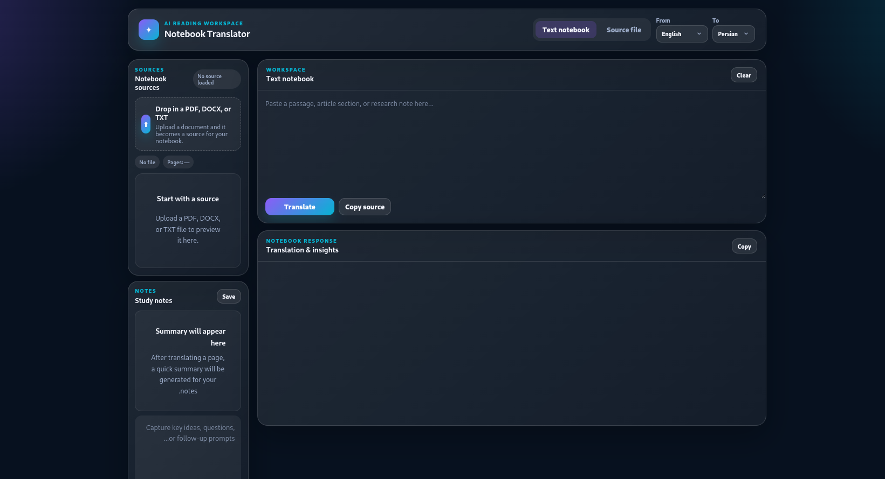

# Notebook Translator

A local AI-powered reading workspace that translates documents (PDF, DOCX, TXT) and text using Ollama and Gemma4. Supports multiple languages, page-by-page translation, summarization, and RTL layouts.

## Features

- Translate text or uploaded documents (PDF, DOCX, TXT)
- Page-by-page or full-document translation
- Auto-generated summaries in the target language
- Persistence: saves notes and extracted document text
- RTL support for Persian, Arabic, and Kurdish
- Local translation caching for faster repeated requests

## Prerequisites

- Python 3.8+
- [Ollama](https://ollama.com/)

## Installation

### 1. Install Ollama

**Linux:**
```bash
curl -fsSL https://ollama.com/install.sh | sh
```

**macOS:**
```bash
brew install ollama && brew services start ollama
```

**Windows:** Download and install from https://ollama.com/download

After installing, ensure Ollama is running:
```bash
ollama --version
```

### 2. Pull the Gemma4 model

```bash
ollama pull gemma4
```

Verify it's available:
```bash
ollama list
```

### 3. Clone and set up this project

```bash
git clone <repository-url>
cd translator
```

### 4. Create and activate a virtual environment

```bash
python -m venv venv
source venv/bin/activate   # Linux/macOS
# venv\Scripts\activate    # Windows
```

### 5. Install dependencies

```bash
pip install -r requirements.txt
```

## Configuration

The app connects to Ollama via environment variables. Set them before running the server if you need custom values:

| Variable | Default | Description |
|----------|---------|-------------|
| `OLLAMA_URL` | `http://192.168.1.3:11434` | Ollama server URL |
| `OLLAMA_MODEL` | `gemma4:e2b` | Model name in Ollama |

**Example:**
```bash
export OLLAMA_URL=http://localhost:11434
export OLLAMA_MODEL=gemma4
python app.py
```

**Note:** If both the server and Ollama run on the same machine, set `OLLAMA_URL` to `http://localhost:11434` or `http://127.0.0.1:11434`.

## Running the app

```bash
source venv/bin/activate
export OLLAMA_URL=http://localhost:11434
export OLLAMA_MODEL=gemma4
python app.py
```

Open `http://localhost:5000` in your browser.

## زاراوەکانی تر

ئەم ئەپلیکەیشنە پشتگیری لە زمانی کوردی دەکات. بۆ وەرگێڕانی دەق یان پەڕەکانی پەڕتووک، زمانی کوردی دیاری بکە و کلیلی Translate بکە.

**تایبەتیەکان:**
- پشتگیری لە زمانی کوردی (سورانی)
- ڕێنوێنی خوارەوەی ڕاست بۆ دەقی کوردی
- وەرگێڕانی پەڕە بە پەڕە یان سەرجەم پەڕتووک

---

*A notebook translator built with Flask, Ollama, and Gemma4 for local, private document translation.*
