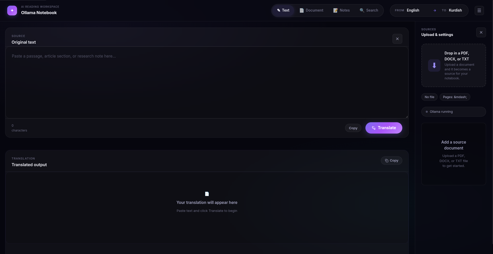

# Notebook Translator


A local AI-powered reading workspace that translates documents (PDF, DOCX, TXT) and text using Ollama. Supports multiple languages, page-by-page translation, summarization, study notes, RTL layouts, and history management.

## Features

- **Translate Text or Documents**: Upload PDF, DOCX, or TXT files for instant translation
- **Page-by-Page Translation**: Navigate through document pages and translate individually or all at once
- **Auto-generated Summaries**: Generate summaries in the target language from translated content
- **Study Notes**: Capture key ideas, questions, and follow-up prompts as you study documents
- **History Management**: View, search, filter, delete, and clear translation history with statistics
- **RTL Support**: Full support for Persian, Arabic, Kurdish (Surani) with right-to-left layout
- **Local Translation Caching**: Faster repeated translations through caching system
- **Multi-Language Support**: Auto-detect source language; translate to English, Arabic, Kurdish, Persian, French, German, Spanish

## Prerequisites

- Python 3.8+
- [Ollama](https://ollama.com/) (local AI model server)

## Installation

### 1. Install Ollama

**Linux:**
```bash
curl -fsSL https://ollama.com/install.sh | sh
```

**macOS:**
```bash
brew install ollama && brew services start ollama
```

**Windows:** Download and install from https://ollama.com/download

After installing, ensure Ollama is running:
```bash
ollama --version
```

### 2. Pull a Model

Pull any model you want to use for translation (e.g., Llama 3.1):
```bash
ollama pull llama3.1
```

Verify it's available:
```bash
ollama list
```

### 3. Clone and set up this project

```bash
git clone <repository-url>
cd translator
```

### 4. Create and activate a virtual environment

```bash
python -m venv venv
source venv/bin/activate   # Linux/macOS
# venv\Scripts\activate    # Windows
```

### 5. Install dependencies

```bash
pip install -r requirements.txt
```

## Configuration

The app connects to Ollama via environment variables. Set them before running the server if you need custom values:

| Variable | Default | Description |
|----------|---------|-------------|
| `OLLAMA_URL` | `http://192.168.1.3:11434` | Ollama server URL |
| `OLLAMA_MODEL` | (auto-detected) | Model name in Ollama |

**Example:**
```bash
export OLLAMA_URL=http://localhost:11434
ollama pull llama3.1
python app.py
```

**Note:** If both the server and Ollama run on the same machine, set `OLLAMA_URL` to `http://localhost:11434` or `http://127.0.0.1:11434`.

## Running the App

```bash
source venv/bin/activate
ollama pull llama3.1   # if you haven't already
python app.py
```

Open `http://localhost:5000` in your browser.

## Usage Guide

### Text Mode (Default)
- Type or paste text directly into the translation area
- Choose source and target languages
- Click **Translate** to get instant results
- View translations, copy them, or save as study notes

### Attachment / Document Mode
1. **Upload a document**: Drag and drop a PDF, DOCX, or TXT file into the sidebar
2. **View pages**: Navigate through document pages with previous/next buttons or page number input
3. **Translate a page**: Click **Translate Page** to translate the current page
4. **Translate all pages**: Click **Translate All** to process every page at once
5. **Generate summary**: After translation, generate a study notes summary from the content

### History Mode
- View all past translations organized by document and language
- Search history entries with keyword filtering
- Filter by source or target language
- Delete individual entries or clear entire history
- View statistics (total translations, unique documents, languages used)

## Supported Languages

**Source Languages:** Auto-detect | Arabic | English | French | German | Italian | Kurdish | Persian | Russian | Spanish | Chinese

**Target Languages:** English | Arabic | Kurdish | Persian | French | German | Spanish

## Architecture

- **Backend**: Python Flask API with RESTful endpoints
- **Frontend**: Responsive HTML/CSS/JavaScript UI
- **AI Engine**: Ollama local AI models for translation and summarization
- **Storage**: Local file system for uploads, outputs, history, and cache

*A notebook translator built with Flask, Ollama, and Gemma4 for local, private document translation.*
